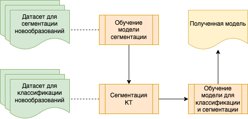

## MRI-Segmentation + Multi-class Classification

Используется модель FasterRCCN с выделением масок (segmentation) патогенов и multi-class классификацией. Для сбора признаков используется сверточная нейронная сеть resnet50. По итогам обучения метрика IoU показывает точность 0.79, а точность классификации на четырех классах - 63%.

## Методы

Сначала обучаем нейронную сеть сигментировать новообразования с помощью датасета [Brain MRI Segmentation](https://www.kaggle.com/datasets/mateuszbuda/lgg-mri-segmentation). Далее, используя датасет [Brain Tumor Classification](https://www.kaggle.com/datasets/sartajbhuvaji/brain-tumor-classification-mri) выделяем новообразования и обучаем вторую нейронную сеть, которая классифицирует и сегментирует новообразования. Данная техника позволит в дальнейшем определять признаки, которые отличают новообразования друг от друга.

## Дальнейшие работы

Две модели можно улучшать до бесконечности: поставить на большее количество эпох, сменить слой для построения feature maps на более специализированные сети, нежели resnet50, придумать способ классификации на основе сегментированных участков и тп.